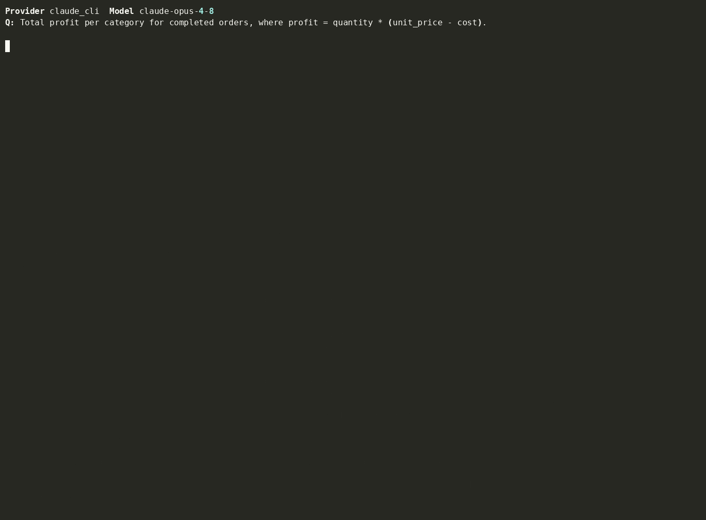
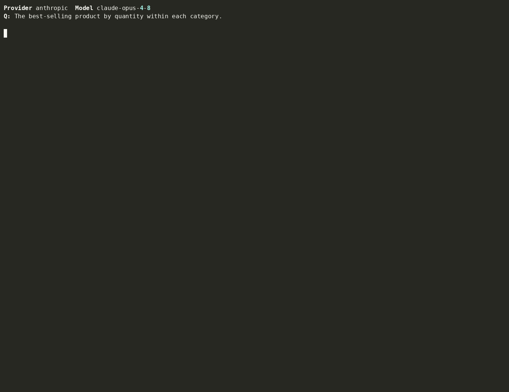
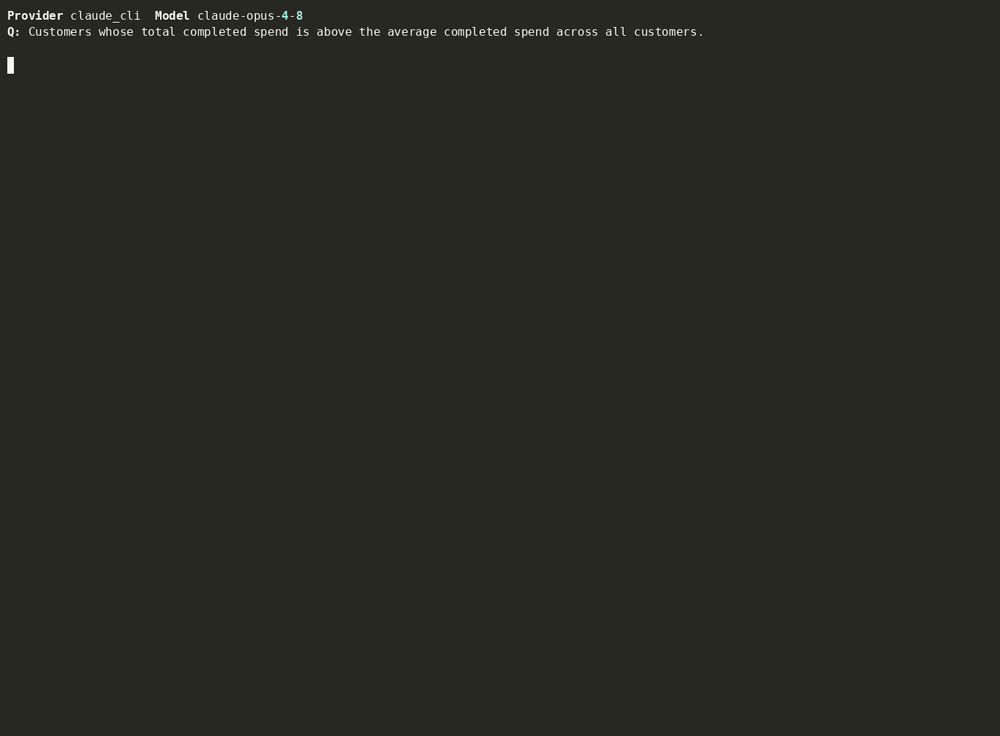
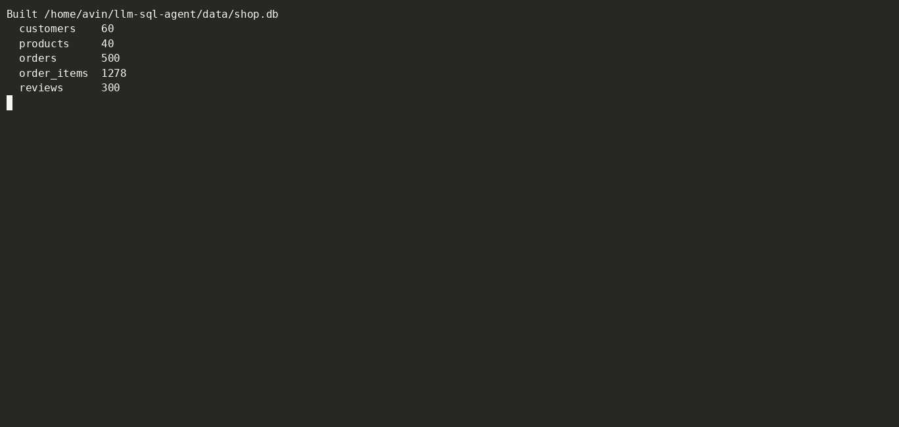

# llm-sql-agent

**A natural-language question goes in, the right SQL comes out — and we measure how much an *agent* beats a one-shot prompt at getting it right.**

[Claude](https://www.anthropic.com/claude "Anthropic's Claude model family")
answers questions over a SQL database by inspecting the schema, writing a query,
running it, reading the error when it fails, and fixing it — a
[tool-calling](https://docs.claude.com/en/docs/agents-and-tools/tool-use/overview "Tool use / function calling — the model emits structured calls your code executes")
agent loop. This repo builds that **two ways** — a **naive** one-shot prompt and an
**agentic** loop — and benchmarks them on a ground-truth eval set across
**accuracy, speed, and token cost**.

> **naive vs. agentic** is the comparison this project exists to make. *Naive* =
> one prompt, one query, no recovery. *Agentic* = the model drives tools over
> multiple steps and repairs its own mistakes. The whole point is to quantify the
> gap.

## Demos

Every command the repo runs, captured as a GIF. The runs below are deliberately
**tiny** — the agent showcases use 3 questions, and the benchmark/compare demos
use just **2 questions** (1 easy + 1 hard), on **Haiku where the model doesn't
matter** — so they're cheap to regenerate. The full benchmark is 35 questions
(`make eval` / `make compare`).

### The agent on complex SQL (Opus 4.8) — `make demos`

Each: schema inspection → query → answer. Repairs on error when one occurs.

**Profit per category** — multi-join + arithmetic


**Best-selling product within each category** — window function + ranking (CTE)


**Above-average-spending customers** — CTE + subquery comparison


### Every command, end to end — `make tour`

**Build the seeded database** — `make db`


**Run the test suite** — `make test`


**Benchmark naive vs. agent** — `make eval` (tiny 2-question run; per-tier accuracy / speed / tokens)


**Compare Opus 4.8 vs. Haiku 4.5** — `make compare` (tiny 2-question run)


## What the benchmark measures

`make eval` runs all 35 graded questions (10 easy / 10 medium / 15 hard) twice —
naive and agent — and prints a per-tier table of **accuracy** (execution accuracy
+ agent repair rate), **speed** (p95 latency, steps), and **cost** (tokens, USD),
writing `results/benchmark_summary.json` and charts. `make compare` runs it on two
models to show where the capability gap shows up (typically the hard tier) and
what the agent loop recovers on the weaker model. (The demos above show both at
small scale.)

## The two approaches

### Naive baseline (`src/llm_sql_agent/naive.py`)
One completion: the whole schema is dumped into the prompt, the model returns a
single SQL string, executed **once**. No introspection, no retry. The control —
it captures the failure modes (hallucinated columns, missed joins, no recovery).

### Agentic loop (`src/llm_sql_agent/agent.py`)
```
reason → call a tool → observe result/error → repair → … → final answer
```
Tools (`src/llm_sql_agent/tools/`): `list_tables`, `describe_table`, `run_sql`.
The orchestration that makes it production-grade:

- **Self-repair** — a failed query's error is fed back so the model fixes it.
- **Guardrails** (`guardrails.py`) — `sqlparse`-validated single read-only
  `SELECT`/`WITH` only (writes rejected), an injected `LIMIT`, and a read-only
  SQLite connection (`mode=ro` + `PRAGMA query_only`). Even a buggy query can't
  mutate the database.
- **Step cap, retries, timeouts** — the loop is bounded; the SDK retries
  transient API errors with backoff; queries have a runaway backstop.
- **Tracing + cost accounting** (`tracing.py`) — every LLM/tool step is a timed
  span with token counts and an estimated USD cost.

## How it's measured

The eval set (`data/eval_set.jsonl`) is 35 graded questions. The metric is
**execution accuracy** (`evals/metrics.py`): run the gold and predicted queries
and compare result sets. It's deliberately robust to two harmless ways a
free-forming model differs from the gold SQL, so it measures *correctness*, not
phrasing:

- **extra columns** — the gold result must be a *projection* of the predicted
  result (a model that returns the answer plus an extra `id` column still counts);
- **row order** — compared as a multiset, except for top-N questions (`ORDER BY`
  + `LIMIT`) where order is part of the answer.

The harness also records p50/p95 latency, step count, tokens, and USD. Re-score
saved runs against the current metric with `python -m evals.rescore` (no new API
calls).

**Tested deterministically, no key required.** `tests/test_agent_loop.py` drives
the agent loop with a scripted LLM double (`tests/fakes.py`) over complex
multi-join / CTE / window-function questions and asserts it recovers from an
injected error and lands on a correct, executing query — and that speed/token
metrics are recorded. `tests/test_smoke.py` is a smoke test that runs the real
Claude backend and checks it produces valid, executing SQL (auto-skipped when the
`claude` CLI isn't on PATH, so the offline suite stays green in CI).

## Backend

One normalized interface (`src/llm_sql_agent/llm/base.py`); the agent and eval
code are backend-agnostic.

| Backend | Status | Notes |
|---|---|---|
| `anthropic` | ✅ default | Claude, reached through the local **`claude` CLI** (`claude -p`) — **no API key**, runs on your Claude Code login. Model via `LLM_MODEL` (`claude-opus-4-8` default; `claude-haiku-4-5` for the comparison). The CLI returns text, so the agent is driven with a JSON-action protocol rather than native `tool_use` blocks. |
| `ollama` | 🟡 roadmap | Local open models. Shipped as a documented stub — the interface and tool registry are designed so it drops in with no changes elsewhere. |

> **On token/cost numbers:** because the backend goes through the `claude` CLI,
> reported tokens/USD include the CLI's own context overhead and aren't a clean
> measure of the agent's own usage. **Accuracy and step count are the meaningful
> axes** in the results below.

## Quick start

**No API key.** The only requirement is the
[`claude` CLI](https://docs.claude.com/en/docs/claude-code) installed and logged
in — the backend runs on your Claude Code session.

```bash
make setup        # venv + install (no LLM SDK; the claude CLI is the backend)
make db           # build the deterministic SQLite database
make test         # offline suite (real-backend smoke test auto-skips if no claude CLI)
make eval         # naive-vs-agent benchmark → table + charts
make compare      # benchmark Opus 4.8 vs Haiku 4.5 → comparison chart
make demos        # render the 3 showcase demo GIFs (needs `agg`)
make demo         # one live trace in the terminal
```

Pick a model: `make eval MODEL=claude-haiku-4-5`.

Charts land in `results/` as PNGs. On WSL, view them with
`explorer.exe results\accuracy.png`; on Linux/macOS use `xdg-open` / `open`.

## Layout

```
src/llm_sql_agent/
  agent.py        agentic loop (tool-calling + self-repair)
  naive.py        one-shot baseline
  guardrails.py   read-only SELECT validation + LIMIT injection
  db.py           read-only SQLite access
  tracing.py      span tracing + token/cost accounting
  tools/          list_tables / describe_table / run_sql + schemas
  llm/            base interface; anthropic backend; ollama (roadmap stub)
data/             schema.sql, deterministic seed.py, eval_set.jsonl (35 questions)
evals/            harness.py, metrics.py, plot.py
scripts/          record_demo.py, render_demos.py (asciicast -> GIF, no root)
tests/            guardrails, tools, metrics, agent-loop (scripted), real smoke
```

## Roadmap

- **Local Ollama backend** — open-model runs with no key/cost (stub in place).
- **LLM-judge eval track** — score the agent's natural-language answer, not just
  the SQL result set.
- **More failure modes in the eval set** — ambiguous questions, schema-change
  robustness, deeper multi-step reasoning.
