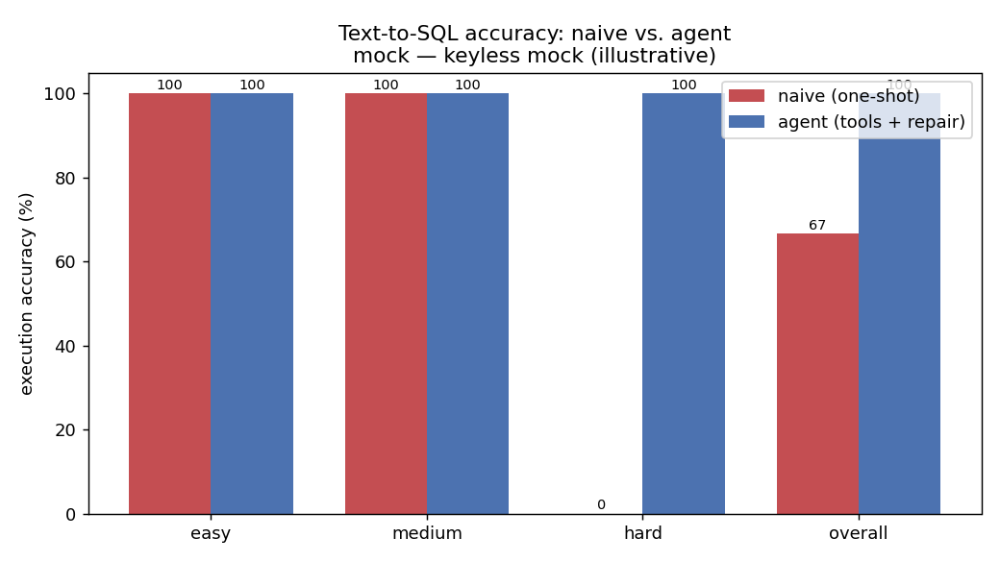
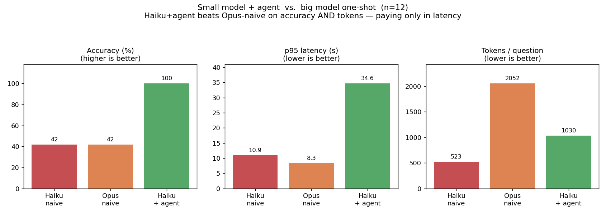

# llm-sql-agent

**A natural-language question deserves the *right* SQL — not a confident guess.**

Ask a question about a database in English. A one-shot prompt writes a single
query and hopes it's right. An **agent** writes a query, *runs* it, reads the
result (or the error), fixes it, and answers. This repo builds both and shows —
with one example and a benchmark — how much that difference is worth.

The backend is [Claude](https://www.anthropic.com/claude) through the local
[`claude` CLI](https://docs.claude.com/en/docs/claude-code) — **no API key**.

## At a glance

| | One-shot (naive) | Agentic |
|---|---|---|
| **Process** | schema in the prompt → one query → run once | inspect schema → query → observe result/error → **repair** → answer |
| **Wrong answer** | returned confidently, undetected | caught — the agent sees the result is off and fixes the query |
| **SQL error** | the request just fails | read the error, correct the query, continue |
| **Cost** | 1 model call | a few calls (the price of being right) |

## Contents

- [The problem](#the-problem)
- [Why agentic wins](#why-agentic-wins) — naive vs. agent
- [Small model + agent beats a big model used naively](#a-small-model--an-agent-beats-a-big-model-used-naively) — the payoff
- [How it works](#how-it-works)
- [Run it](#run-it)
- [Notes](#notes)

---

## The problem

Hand a capable model your schema and it will usually write decent SQL. But a
*single* query is a guess: on a question with a ratio, a window function, or a
subtle join, the model returns a plausible answer that's quietly **wrong** — and
nothing checks it. If the query has a syntax or column error, the whole request
just fails. There's no second look.

An agent closes that gap by **executing**: it runs the query, sees the rows (or
the error), and revises. That's the entire thesis of this repo, and it's worth
exactly what the example below shows.

---

## Why agentic wins

Both approaches start with **only the question** — neither is handed the schema.
The one-shot must guess table and column names and gets one try. The agent calls
`describe_table` to learn the real schema and runs its query to check it. On a
clean schema, easy questions tie; on anything needing real column names, the
blind one-shot falls apart.



**42% → 100%.** Easy questions (no columns needed) tie at 100%. On medium and
hard, the one-shot guesses wrong and fails; the agent discovers the schema and
verifies. Here's a real failure — *"total revenue per category for completed
orders"* on Claude Haiku 4.5:

```sql
-- NAIVE (one-shot, blind): guesses column/table names
SELECT p.category, SUM(oi.quantity * oi.price)   -- ✗ no such column: oi.price
FROM orders o JOIN order_items oi ON o.id = oi.order_id ...

-- AGENT (after describe_table): uses the real columns
SELECT p.category, SUM(oi.quantity * oi.unit_price)   -- ✓ correct
FROM orders o JOIN order_items oi ON o.order_id = oi.order_id ...
```

The agent also **recovers from its own errors**: when a query fails to execute,
the error is fed back and it repairs (Opus repaired 17% of the questions in the
run above). Try it live: `make demo`.

---

## A small model + an agent beats a big model used naively

Here's the payoff. Three configurations, three axes — **accuracy, latency, tokens**:



**Haiku + agent vs. Opus one-shot:** higher accuracy (**100% vs 42%**) *and*
fewer tokens (**1030 vs 2052/question**). The agent's tool calls cost more
**latency** (it makes several round-trips) — that's the trade. So the
intelligence you need for hard SQL comes from the **loop**, not from a bigger
model: wrap a cheap model in an agent and you beat the expensive one-shot, for
less.

> The metric is **execution accuracy** (run gold vs. predicted, compare result
> sets; robust to extra columns and to row order except for top-N). Charts come
> from a 12-question run (4 per tier) on the `claude` CLI backend — `make eval`
> (single model) and `make compare` (both models) run the full 35.

---

## How it works

### The agentic loop (`src/llm_sql_agent/agent.py`)

```
reason → call a tool → observe result/error → repair → … → final answer
```

Tools (`src/llm_sql_agent/tools/`): `list_tables`, `describe_table`, `run_sql`.
What makes it production-grade rather than a while-loop:

- **Self-repair** — a failed query's error is fed back so the model fixes it.
- **Guardrails** (`guardrails.py`) — `sqlparse`-validated single read-only
  `SELECT`/`WITH` only (writes rejected), an injected `LIMIT`, and a read-only
  SQLite connection (`mode=ro` + `PRAGMA query_only`). A buggy query can't mutate
  the database.
- **Bounded** — hard step cap, per-call retries, and a runaway-query backstop.
- **Tracing + accounting** (`tracing.py`) — every step is a timed span with token
  counts (printed by `make demo`).

The **naive baseline** (`naive.py`) is the control: the question only, one query,
executed once, no introspection and no recovery.

### One backend, swappable

A normalized interface (`llm/base.py`) keeps the agent backend-agnostic. Today
there's one backend — **Claude via the `claude` CLI** (no API key; the CLI
returns text, so the agent is driven with a JSON-action protocol). A local
**Ollama** backend is stubbed on the roadmap and drops in without touching the
agent or eval code.

### Tested without burning tokens

`tests/test_agent_loop.py` drives the loop with a scripted LLM double
(`tests/fakes.py`) over complex multi-join / CTE / window questions and asserts it
recovers from an injected error and lands on a correct query — deterministic, no
API calls. `tests/test_smoke.py` runs the real backend when the `claude` CLI is
present (auto-skips otherwise).

---

## Run it

**No API key** — just the [`claude` CLI](https://docs.claude.com/en/docs/claude-code)
installed and logged in.

```bash
make setup        # venv + install (no LLM SDK; the claude CLI is the backend)
make db           # build the deterministic SQLite database
make demo         # live one-shot-vs-agent showcase on one question
make test         # offline suite (smoke test auto-skips without the claude CLI)

make eval         # full 35-question benchmark + accuracy chart
make compare      # Opus 4.8 vs Haiku 4.5 + comparison chart
```

Pick a model anywhere with `MODEL=claude-haiku-4-5` (e.g. `make eval MODEL=...`).

---

## Notes

> **Token/cost figures** go through the `claude` CLI, so they include the CLI's
> own context overhead — read them as *relative* (the ~10× Haiku/Opus ratio is
> real), not as the agent's raw API cost. **Accuracy is the meaningful axis.**

- The database (`data/seed.py`) is seeded from a fixed RNG, so results are
  reproducible. The 35-question eval set lives in `data/eval_set.jsonl`.
- The committed charts come from a 12-question run to keep cost down; `make eval`
  / `make compare` run the full 35. Charts (`results/*.png`) are committed;
  regenerable result JSON is gitignored.
- **Roadmap:** local Ollama backend; an LLM-judge eval track (grade the answer,
  not just the result set); more failure modes in the eval set.
