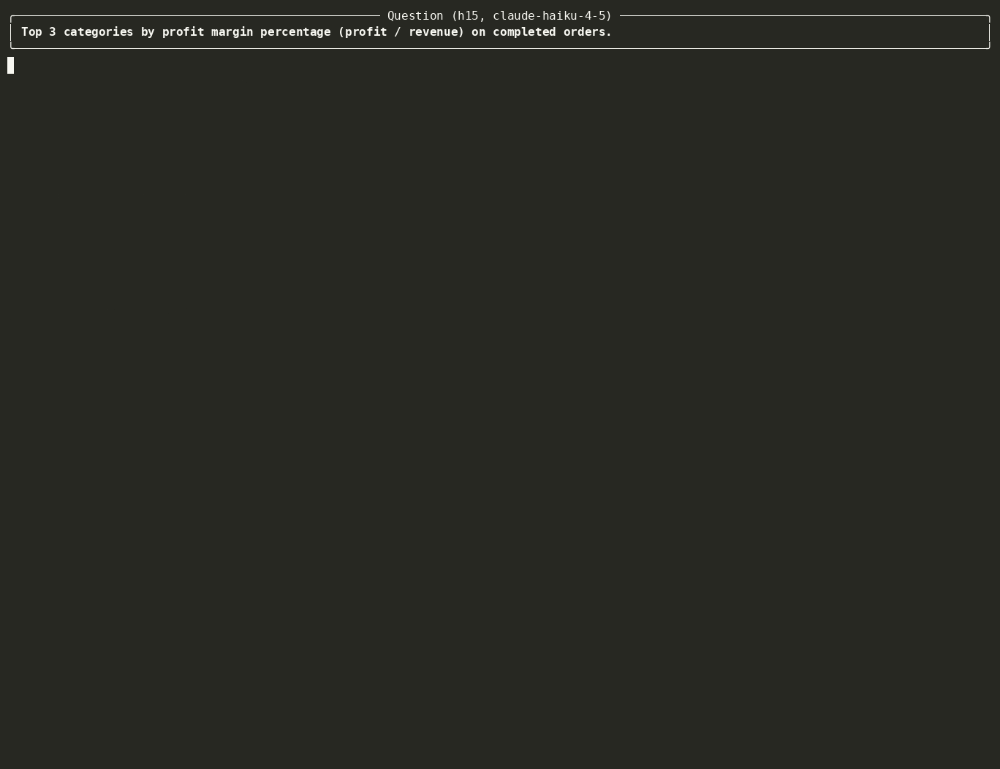
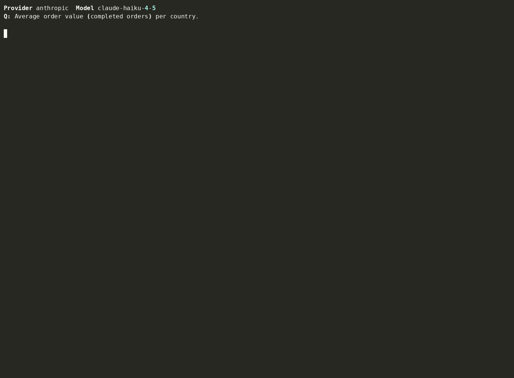
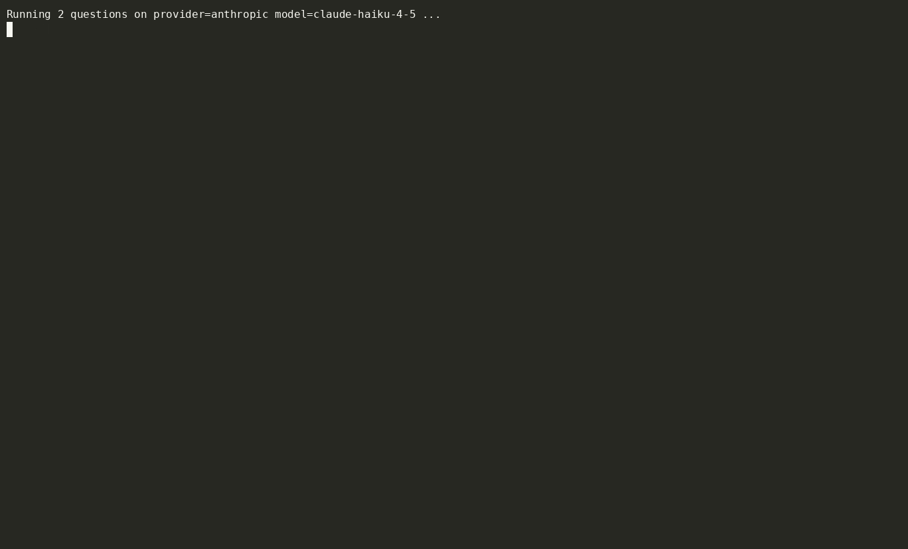
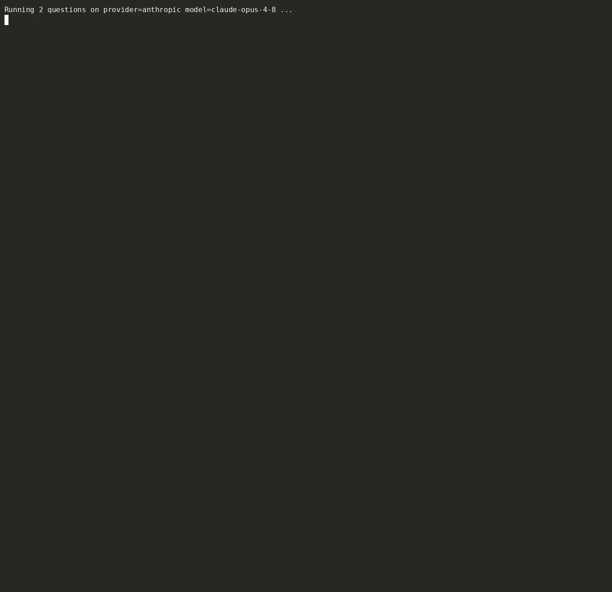

# llm-sql-agent

**A natural-language question deserves the *right* SQL — not a confident guess.**

Ask a question about a database in English. A one-shot prompt writes a single
query and hopes it's right. An **agent** writes a query, *runs* it, reads the
result (or the error), fixes it, and answers. This repo builds both and shows —
with one example and a benchmark — how much that difference is worth.

The backend is [Claude](https://www.anthropic.com/claude) through the local
[`claude` CLI](https://docs.claude.com/en/docs/claude-code) — **no API key**.

## At a glance

| | One-shot (naive) | Agentic |
|---|---|---|
| **Process** | schema in the prompt → one query → run once | inspect schema → query → observe result/error → **repair** → answer |
| **Wrong answer** | returned confidently, undetected | caught — the agent sees the result is off and fixes the query |
| **SQL error** | the request just fails | read the error, correct the query, continue |
| **Cost** | 1 model call | a few calls (the price of being right) |

## Contents

- [The problem](#the-problem)
- [Why agentic wins](#why-agentic-wins) — the one example that matters
- [Benchmark](#benchmark) — naive vs. agent, and Opus vs. Haiku
- [How it works](#how-it-works)
- [Run it](#run-it)
- [Notes](#notes)

---

## The problem

Hand a capable model your schema and it will usually write decent SQL. But a
*single* query is a guess: on a question with a ratio, a window function, or a
subtle join, the model returns a plausible answer that's quietly **wrong** — and
nothing checks it. If the query has a syntax or column error, the whole request
just fails. There's no second look.

An agent closes that gap by **executing**: it runs the query, sees the rows (or
the error), and revises. That's the entire thesis of this repo, and it's worth
exactly what the example below shows.

---

## Why agentic wins

**Same question, two approaches.** The one-shot writes a confident query and
returns the **wrong** answer. The agent runs its query, checks the result against
the database, and returns the **right** one.



**Error recovery.** When a query *does* error, the agent reads the message,
corrects the query, and keeps going — the one-shot has no second chance.



> Both demos run on **Claude Haiku 4.5** — a smaller model makes the gap visible.
> The same loop runs on any Claude model (`make demo` to try it live).

---

## Benchmark

35 graded questions (10 easy / 10 medium / 15 hard), each run **twice** — naive
and agent. The metric is **execution accuracy**: run the gold and predicted
queries and compare result sets (robust to extra columns and to row order except
for top-N). It also records repair rate, steps, latency, and tokens.

**`make eval`** — naive vs. agent, per tier *(demo is a tiny 2-question run; the real one does all 35)*:



**`make compare`** — the same benchmark on two models, to see where the
capability gap shows up (the hard tier) and what the agent loop recovers on the
weaker model:



---

## How it works

### The agentic loop (`src/llm_sql_agent/agent.py`)

```
reason → call a tool → observe result/error → repair → … → final answer
```

Tools (`src/llm_sql_agent/tools/`): `list_tables`, `describe_table`, `run_sql`.
What makes it production-grade rather than a while-loop:

- **Self-repair** — a failed query's error is fed back so the model fixes it.
- **Guardrails** (`guardrails.py`) — `sqlparse`-validated single read-only
  `SELECT`/`WITH` only (writes rejected), an injected `LIMIT`, and a read-only
  SQLite connection (`mode=ro` + `PRAGMA query_only`). A buggy query can't mutate
  the database.
- **Bounded** — hard step cap, per-call retries, and a runaway-query backstop.
- **Tracing + accounting** (`tracing.py`) — every step is a timed span with token
  counts (shown in the demos).

The **naive baseline** (`naive.py`) is the control: full schema in the prompt,
one query, executed once, no recovery.

### One backend, swappable

A normalized interface (`llm/base.py`) keeps the agent backend-agnostic. Today
there's one backend — **Claude via the `claude` CLI** (no API key; the CLI
returns text, so the agent is driven with a JSON-action protocol). A local
**Ollama** backend is stubbed on the roadmap and drops in without touching the
agent or eval code.

### Tested without burning tokens

`tests/test_agent_loop.py` drives the loop with a scripted LLM double
(`tests/fakes.py`) over complex multi-join / CTE / window questions and asserts it
recovers from an injected error and lands on a correct query — deterministic, no
API calls. `tests/test_smoke.py` runs the real backend when the `claude` CLI is
present (auto-skips otherwise).

---

## Run it

**No API key** — just the [`claude` CLI](https://docs.claude.com/en/docs/claude-code)
installed and logged in.

```bash
make setup        # venv + install (no LLM SDK; the claude CLI is the backend)
make db           # build the deterministic SQLite database
make demo         # live one-shot-vs-agent showcase on one question
make test         # offline suite (smoke test auto-skips without the claude CLI)

make eval         # full 35-question benchmark + charts
make compare      # Opus 4.8 vs Haiku 4.5 + comparison chart
make demos        # re-render the demo GIFs (needs `agg`)
```

Pick a model anywhere with `MODEL=claude-haiku-4-5` (e.g. `make eval MODEL=...`).

---

## Notes

> **Token/cost figures** shown in the demos go through the `claude` CLI, so they
> include the CLI's own context overhead — read them as relative, not as the
> agent's raw API cost. **Accuracy and step count are the meaningful axes.**

- The database (`data/seed.py`) is seeded from a fixed RNG, so results are
  reproducible. The 35-question eval set lives in `data/eval_set.jsonl`.
- Demos are deliberately tiny (Haiku, 1–2 questions) to keep them cheap to
  regenerate. Generated charts/JSON are gitignored; only the committed demo GIFs
  are kept.
- **Roadmap:** local Ollama backend; an LLM-judge eval track (grade the answer,
  not just the result set); more failure modes in the eval set.
