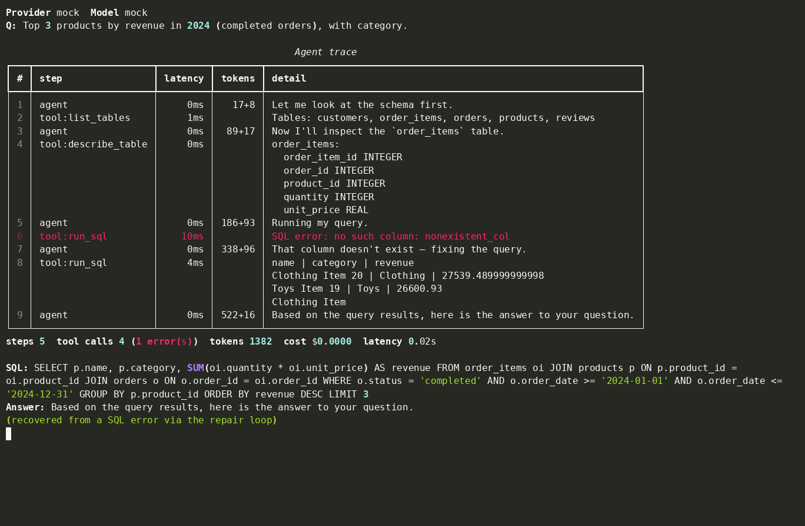

# llm-sql-agent

**A natural-language question goes in, the right SQL comes out — and we measure how much an *agent* beats a one-shot prompt at getting it right.**

An [LLM](https://en.wikipedia.org/wiki/Large_language_model "Large Language Model")
answers questions over a SQL database by inspecting the schema, writing a query,
running it, reading the error when it fails, and fixing it — a
[tool-calling](https://docs.claude.com/en/docs/agents-and-tools/tool-use/overview "Tool use / function calling — the model emits structured calls your code executes")
agent loop. This repo builds that **two ways** — a naive one-shot prompt and a
production agent — and benchmarks them on a ground-truth eval set across
**accuracy, speed, and token cost**.

It runs **with zero API keys** (a deterministic mock backend), and against a real
model (Claude) when you have a key.

## Demo



The agent inspects the schema, runs a query, **hits a SQL error, repairs it**, and
answers — `make demo`, no API key. (Regenerate the GIF with `make gif`, or
`make tape` if you have [VHS](https://github.com/charmbracelet/vhs).)

## Results


The keyless mock run (`make eval`) is **illustrative and deterministic** — it
simulates a model that fumbles harder queries and an agent that recovers from the
error. It exists so the whole pipeline is reproducible by anyone, and so the
benchmark can be a *test* (see below). For **real headline numbers**, point it at
a model:

```bash
ANTHROPIC_API_KEY=sk-ant-... make eval-real PROVIDER=anthropic
```

`make eval` prints a per-tier table and writes `results/benchmark_summary.json`:

```
 tier    │ naive acc │ agent acc │ repair rate │ steps │ p95 lat │ tokens
 easy    │     100%  │     100%  │       0%    │  4.0  │    2ms  │   585
 medium  │     100%  │     100%  │     100%    │  5.0  │    8ms  │  1152
 hard    │       0%  │     100%  │     100%    │  5.0  │   11ms  │  1336
 overall │      67%  │     100%  │      67%    │  4.7  │   11ms  │  1024
```

The agent trades **more tokens and more steps** for **higher accuracy** — exactly
the production trade-off this project is about. `results/latency_tokens.png` charts that cost.

## The two approaches

### Naive baseline (`src/llm_sql_agent/naive.py`)
One completion: the whole schema is dumped into the prompt, the model returns a
single SQL string, and it's executed **once**. No introspection, no retry. This is
the control — it captures the failure modes (hallucinated columns, missed joins,
no error recovery).

### Production agent (`src/llm_sql_agent/agent.py`)
A multi-step **tool-calling loop**:

```
reason → call a tool → observe result/error → repair → … → final answer
```

Tools (`src/llm_sql_agent/tools/`): `list_tables`, `describe_table`, `run_sql`.
The orchestration concerns that make it production-grade:

- **Self-repair** — a failed query's error is fed back so the model fixes it.
- **Guardrails** (`guardrails.py`) — `sqlparse`-validated single read-only
  `SELECT`/`WITH` only (writes rejected), an injected `LIMIT`, and a read-only
  SQLite connection (`mode=ro` + `PRAGMA query_only`). Defence in depth: even a
  buggy query can't mutate the database.
- **Step cap, retries, timeouts** — the loop is bounded; LLM calls retry with
  backoff; queries have a runaway backstop.
- **Tracing + cost accounting** (`tracing.py`) — every LLM/tool step is a timed
  span with token counts and an estimated USD cost.

## How it's measured

The eval set (`data/eval_set.jsonl`) is 30 graded questions (easy / medium / hard).
The metric is **execution accuracy** (`evals/metrics.py`): run the gold and
predicted queries and compare result sets — order-insensitive unless the gold
query has a top-level `ORDER BY`. The harness also records **speed** (p50/p95
latency, step count) and **cost** (tokens, USD), per tier.

**The benchmark is a test.** `tests/test_benchmark.py` runs the full harness on the
mock backend and asserts on the metrics — agent accuracy beats naive, repair rate
> 0, and the speed/token numbers are recorded. "We measure accuracy, speed, and
tokens" is a checked property, not a claim in a README.

## Provider-agnostic by design

Every backend implements one normalized interface (`src/llm_sql_agent/llm/base.py`):

| Backend | Status | Notes |
|---|---|---|
| `mock` | ✅ default | Deterministic, keyless. Powers `make eval`, `make demo`, and the tests. Simulates outcomes from the gold SQL — **illustrative, not a real model**. |
| `anthropic` | ✅ | Claude via the Messages API with native tool-use. `claude-opus-4-8` by default; set `LLM_MODEL=claude-sonnet-4-6` for a cheaper run. |
| `ollama` | 🟡 roadmap | Local models, no key/cost. Shipped as a documented stub — the interface and tool registry are designed so it drops in with no changes elsewhere. |

## Quick start

No API key needed:

```bash
make setup        # venv + install
make db           # build the deterministic SQLite database
make eval         # run the benchmark (mock) and render charts
make demo         # live single-question trace (text)
make test         # full suite incl. benchmark-as-tests
make gif          # record results/demo.gif (needs `agg`; no root)
```

Charts land in `results/` as PNGs. On WSL, view them with
`explorer.exe results\accuracy.png` (or open the `results/` folder in Explorer);
on Linux/macOS use `xdg-open` / `open`.

A real run (needs `ANTHROPIC_API_KEY`):

```bash
make eval-real PROVIDER=anthropic                       # claude-opus-4-8
make eval-real PROVIDER=anthropic MODEL=claude-sonnet-4-6
```

### `make demo` output

```
$ sql-agent ask "Top 3 products by revenue in 2024 (completed orders), with category"

 # │ step          │ latency │ tokens │ detail
 1 │ agent         │   0ms   │  …     │ Let me look at the schema first.
 2 │ tool:list_tables
 3 │ agent         │   0ms   │  …     │ Now I'll inspect the `order_items` table.
 4 │ tool:describe_table
 5 │ agent         │   0ms   │ 186+93 │ Running my query.
 6 │ tool:run_sql  │  10ms   │        │ SQL error: no such column: nonexistent_col
 7 │ agent         │   0ms   │ 338+96 │ That column doesn't exist — fixing the query.
 8 │ tool:run_sql  │   4ms   │        │ name | category | revenue …
 9 │ agent         │   0ms   │ 522+16 │ Based on the query results, here is the answer.

steps 5  tool calls 4 (1 error)  tokens 1382  cost $0.0000  latency 0.02s
(recovered from a SQL error via the repair loop)
```

## Layout

```
src/llm_sql_agent/
  agent.py        production agent loop (tool-calling + self-repair)
  naive.py        one-shot baseline
  guardrails.py   read-only SELECT validation + LIMIT injection
  db.py           read-only SQLite access
  tracing.py      span tracing + token/cost accounting
  tools/          list_tables / describe_table / run_sql + schemas
  llm/            base interface, mock / anthropic / ollama backends
data/             schema.sql, deterministic seed.py, eval_set.jsonl
evals/            harness.py, metrics.py, plot.py
tests/            guardrails, tools, metrics, benchmark-as-tests
```

## Roadmap

- **Local Ollama backend** — open-model runs with no key/cost (stub in place).
- **LLM-judge eval track** — score the agent's natural-language answer, not just
  the SQL result set.
- **More failure modes in the eval set** — ambiguous questions, multi-step
  reasoning, schema-change robustness.

## Notes

The keyless `mock` backend is a **test double**: it simulates outcomes from the
gold SQL so the pipeline is fully reproducible offline. Numbers from `make eval`
are illustrative. Real model performance comes from `make eval-real`.
